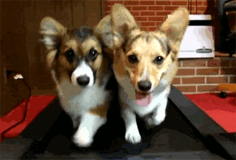

# [fit] GIT 
# [fit] Collaboration

### UVA, Fall 2015

--- 

# __*Austin Lamon*__
### iOS Developer @ Capital One
### UVA May 2015 Graduate (CS & CPE) 

--- 

# So...
## What the hell is _Git_?

---

--- 

# Git
###*Version Control System
###*Knower of all History
###*Tracker of all changes, stored far far away

---

## [fit] Why Do You Care?
- Access to *any* version, regardless of how dated
	- Easily jump back and forth, through all changes
- _**Collaborate**_ with others, view their changes, or revert them!

---

## [fit] Concept: _**Repository**_
### A central location in which data is stored and managed
- .git == repository for gitHub, bitbucket, etc.
- Initialize locally in exisiting directory
- Clone something on the interwebs

---

## [fit] Concept: _**Commit**_
### Snapshot of files at a point in time
- A bookmark in history
- It can be reverted to at any time

---

---

## [fit] What Really Matters?
- Collaboration: Remote Repository
	- Push & Pull

`$ git pull [remote-repo] [remote-branch]`
`$ git pull origin master`

---

## [fit] Concept: _**Merge**_
- So I push some stuff...then you break it all
	- AKA `merge conflict`
- Pick better solution, test, push again 

---

# [fit] Typical
# [fit] Workflow

---

1. Create New Repository or Clone Remote
2. `$ git commit -a -m "initial commit"`
3. `$ git push origin master`
4. Add new stuff:
	- `$ git commit -a -m "I did crazy stuff"`
	- `$ git push origin master`
1. :tada::boom::confetti_ball:

---

---

# [fit] Tips & Tools
- git-scm.com/
- SourceTree
- help.github.com/articles/
- Google it!

---

